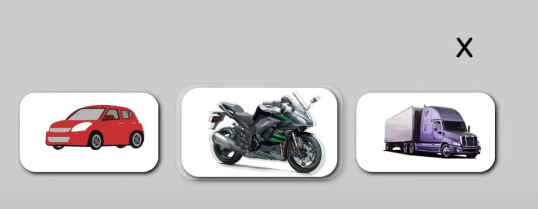
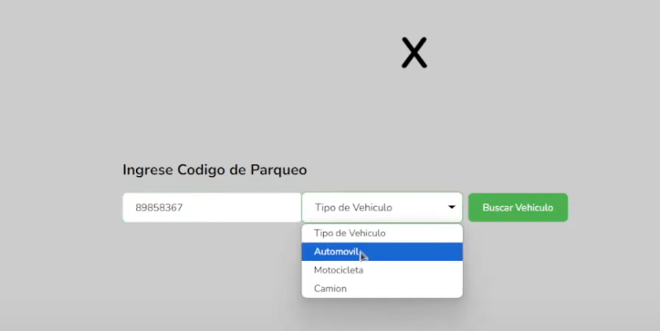
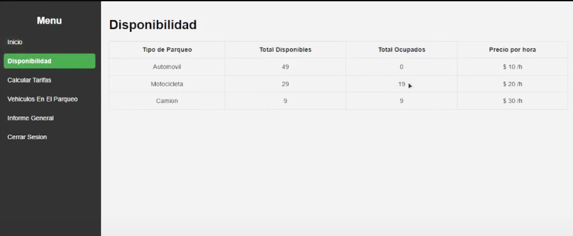
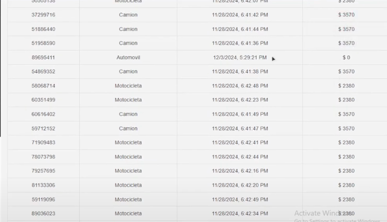
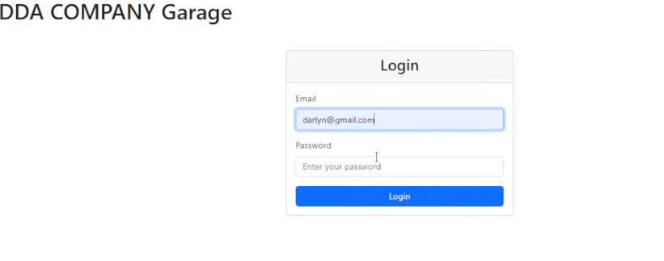

# Sistema de Gestión de Parqueos

## Descripción General
Este proyecto es un sistema de gestión de parqueos que consta de dos componentes principales: un frontend para clientes y administradores, y un backend que maneja la lógica del servidor y la base de datos.

## Vistas del sistema

### Interfaz de Cliente

### Panel de Administración

### Sistema de Login

*Pantalla de inicio de sesión*

## Estructura del Proyecto

### Frontends
El frontend está dividido en dos secciones principales:

#### 1. Cliente
- **Cliente.html**: Interfaz principal para los usuarios del parqueo
- **Main.js**: Lógica principal del cliente
- **Styles.css**: Estilos y diseño de la interfaz del cliente

#### 2. Vista Administrador
- **src/**: Código fuente del panel de administración
- **DashBoard/**: Panel de control para administradores
- **Login/**: Sistema de autenticación para administradores

### Backend
El backend está estructurado de la siguiente manera:

#### 1. Servidor
- **Servidor.sln**: Solución principal del servidor
- **Servidor/**: Código fuente del servidor

#### 2. Base de Datos
- **SQLSCRIPT/**: Scripts SQL para la configuración y mantenimiento de la base de datos

## Requisitos del Sistema

### Frontend
- Navegador web moderno
- JavaScript habilitado
- Conexión a internet

### Backend
- .NET Framework (versión específica según el proyecto)
- SQL Server
- Servidor web compatible con ASP.NET

## Instalación

1. Clonar el repositorio
2. Configurar la base de datos usando los scripts en `BackEnd/SQLSCRIPT/`
3. Configurar el servidor backend
4. Desplegar el frontend en un servidor web

## Uso

### Cliente
1. Acceder a la interfaz del cliente
2. Seleccionar el tipo de servicio deseado
3. Seguir las instrucciones en pantalla

### Administrador
1. Acceder al panel de administración
2. Iniciar sesión con credenciales de administrador
3. Utilizar el dashboard para gestionar el parqueo

## Mantenimiento

### Base de Datos
- Realizar backups periódicos
- Ejecutar scripts de mantenimiento según sea necesario

### Servidor
- Mantener actualizado el .NET Framework
- Monitorear logs del servidor
- Realizar mantenimiento preventivo

## Soporte
Para soporte técnico o reportar problemas, contactar al equipo de desarrollo.

## Licencia
Este proyecto está licenciado bajo la Licencia MIT - ver el archivo [LICENSE](LICENSE) para más detalles.

MIT License

Copyright (c) 2024 Sistema de Gestión de Parqueos

Permission is hereby granted, free of charge, to any person obtaining a copy
of this software and associated documentation files (the "Software"), to deal
in the Software without restriction, including without limitation the rights
to use, copy, modify, merge, publish, distribute, sublicense, and/or sell
copies of the Software, and to permit persons to whom the Software is
furnished to do so, subject to the following conditions:

The above copyright notice and this permission notice shall be included in all
copies or substantial portions of the Software.

THE SOFTWARE IS PROVIDED "AS IS", WITHOUT WARRANTY OF ANY KIND, EXPRESS OR
IMPLIED, INCLUDING BUT NOT LIMITED TO THE WARRANTIES OF MERCHANTABILITY,
FITNESS FOR A PARTICULAR PURPOSE AND NONINFRINGEMENT. IN NO EVENT SHALL THE
AUTHORS OR COPYRIGHT HOLDERS BE LIABLE FOR ANY CLAIM, DAMAGES OR OTHER
LIABILITY, WHETHER IN AN ACTION OF CONTRACT, TORT OR OTHERWISE, ARISING FROM,
OUT OF OR IN CONNECTION WITH THE SOFTWARE OR THE USE OR OTHER DEALINGS IN THE
SOFTWARE.
